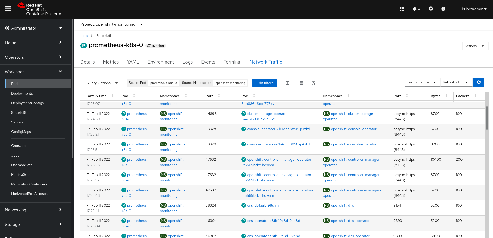

# Network Observability Operator (NOO)

[](https://quay.io/repository/netobserv/network-observability-operator)

An OpenShift / Kubernetes operator for network observability. It deploys a flow collector (IPFIX standard), an OpenShift console plugin (if working with OpenShift) and it configures the OpenShift Cluster Network Operator to enable flow exports. The `OVN-Kubernetes` CNI is required.

A Grafana dashboard is also provided.

It is also possible to use without OpenShift:
- Using the upstream [ovn-kubernetes](https://github.com/ovn-org/ovn-kubernetes/) with any supported Kubernetes flavour ([see below](#ovnk-config) for enabling IPFIX exports on ovn-kubernetes).
- If you don't use ovn-kubernetes but still can manage having IPFIX exports by a different mean, you're more on your own, but still should be able to use this operator. You will need to configure the IPFIX export to push flows to the `goflow-kube` service deployed by this operator. You could also consider using [goflow-kube](https://github.com/netobserv/goflow2-kube-enricher) directly.

The operator itself is deployed in the namespace "network-observability", whereas managed components are deployed in a namespace configured via a Custom Resource (see [FlowCollector custom resource](#flowcollector-custom-resource) section below).

## Deploy an existing image

Images are built and pushed through CI to [quay.io](https://quay.io/repository/netobserv/network-observability-operator?tab=tags).

The operator isn't yet bundled for OLM or Openshift Operator Hub, so you need to clone this repo and deploy from there at the moment.

To refer to the latest version of the `main` branch, use `IMG=quay.io/netobserv/network-observability-operator:main` or simply `VERSION=main`. To refer to older versions, use the commit short-SHA as the image tag. By default, `main` will be used.

E.g. to deploy the latest build:

```bash
make deploy
```

You must then install the custom resource, e.g.:

```bash
kubectl apply -f ./config/samples/flows_v1alpha1_flowcollector.yaml
```

## Build / push / deploy

The repository `quay.io/netobserv/network-observability-operator` is only writable by the CI, so you need to use another repository (such as your own one) if you want to use your own build.

For instance, to build from a pull-request, checkout that PR (e.g. using github CLI or `git fetch upstream pull/99/head:pr-99 && git checkout pr-99` (replace `99` with the PR ID)), then run:

```bash
IMG="quay.io/youraccount/network-observability-operator:v0.0.1" make image-build image-push deploy
```

Note, the default image pull policy is `IfNotPresent`, so if you previously deployed the operator on a cluster and then create another build with the same image name/tag, it won't be pulled in the cluster registry. So you need either to provide a different image name/tag for every build, or modify [manager.yaml](./config/manager/manager.yaml) to set `imagePullPolicy: Always`, then re-deploy.

Then, you can deploy a custom resource, e.g.:

```bash
kubectl apply -f ./config/samples/flows_v1alpha1_flowcollector.yaml

# or using make
make create-sample
```

## Deploy as bundle

For more details, refer to the [Operator Lifecycle Manager (OLM) bundle quickstart documentation](https://sdk.operatorframework.io/docs/olm-integration/quickstart-bundle/).

This task should be automatically done by the CI/CD pipeline. However, if you want to deploy as
bundle for local testing, you should execute the following commands:

```
export USER=<container-registry-username>
export VERSION=0.0.1
export IMG=quay.io/$USER/network-observability-operator:v$VERSION
export BUNDLE_IMG=quay.io/$USER/network-observability-operator-bundle:v$VERSION
make image-build image-push
make bundle bundle-build bundle-push
```

Optionally, you might validate the bundle:
```
operator-sdk bundle validate $BUNDLE_IMG
```

### Deploy as bundle from command line

This mode is recommended to quickly test the operator during its development:

```
operator-sdk run bundle $BUNDLE_IMG
```

### Deploy as bundle from the Console's OperatorHub page

This mode is recommended when you want to test the customer experience of navigating through the
operators' catalog and installing/configuring it manually through the UI.

First, create and push a catalog image:

```
export CATALOG_IMG=quay.io/$USER/network-observability-operator-catalog:v$VERSION
make catalog-build catalog-push catalog-deploy
```

The Netobserv Operator should be now available in the OperatorHub items.

## Publish on central OperatorHub

We target two distincts repositories for OperatorHub: one for [generic community](https://github.com/k8s-operatorhub/community-operators) (non-OpenShift) and one for [OpenShift / OKD community](https://github.com/redhat-openshift-ecosystem/community-operators-prod).

Assuming the components release images are already pushed and tagged, you can then publish the new version on the operator hubs. Make sure you have forked/cloned/fetched each of the two repos mentioned above, then run:

```bash
# Adapt version (without "v" prefix, e.g. version="0.1.5")
version="the-new-version"
# Adapt to your local path:
path_hubs=("../community-operators" "../community-operators-okd")

VERSION="$version" IMAGE_TAG_BASE="quay.io/netobserv/network-observability-operator" make bundle bundle-build bundle-push
for hub in "${path_hubs[@]}"; do
  mkdir -p $hub/operators/netobserv-operator/$version && \
  cp "bundle.Dockerfile" "$hub/operators/netobserv-operator/$version" && \
  cp -r "bundle/manifests" "$hub/operators/netobserv-operator/$version" && \
  cp -r "bundle/metadata" "$hub/operators/netobserv-operator/$version"
done
for hub in "${path_hubs[@]}"; do
  cd $hub && \
  git add -A && \
  git commit -m "operators netobserv-operator ($version)" && \
  git push origin HEAD:bump-$version
done
```

Then go to github and open a new PR for each repo.

(See also `hack/release.sh` file)

## FlowCollector custom resource

The `FlowCollector` custom resource is used to configure the operator and its managed components. You can read its [full documentation](https://github.com/netobserv/network-observability-operator/blob/main/docs/FlowCollector.md) and check this [sample file](./config/samples/flows_v1alpha1_flowcollector.yaml) that you can copy, edit and install.

Note that the `FlowCollector` resource must be unique and must be named `cluster`. It applies to the whole cluster.

## Enabling OVS IPFIX export

If you use OpenShift 4.10, you don't have anything to do: the operator will configure OVS *via* the Cluster Network Operator. Else, some manual steps are still required:

<a name="ovnk-config"></a>

### With upstream ovn-kubernetes (e.g. using KIND)

```bash
GF_IP=`kubectl get svc goflow-kube -n network-observability -ojsonpath='{.spec.clusterIP}'` && echo $GF_IP
kubectl set env daemonset/ovnkube-node -c ovnkube-node -n ovn-kubernetes OVN_IPFIX_TARGETS="$GF_IP:2055"
```

### On older OpenShift with OVN-Kubernetes CNI

In OpenShift, a difference with the upstream `ovn-kubernetes` is that the flows export config is managed by the `ClusterNetworkOperator`.

```bash
GF_IP=`oc get svc goflow-kube -n network-observability -ojsonpath='{.spec.clusterIP}'` && echo $GF_IP
oc patch networks.operator.openshift.io cluster --type='json' -p "[{'op': 'add', 'path': '/spec', 'value': {'exportNetworkFlows': {'ipfix': { 'collectors': ['$GF_IP:2055']}}}}]"
```

## Installing Loki

Loki is used to store the flows, however its installation is not managed directly by the operator. There are several options to install Loki, like using the `loki-operator` or the helm charts. Get some help about it on [this page](https://github.com/netobserv/documents/blob/main/hack_loki.md).

Once Loki is setup, you may have to update the `flowcollector` CR to update the Loki URL (use an URL that is accessible in-cluster by the `goflow-kube` pods; default is `http://loki:3100/`).

## Enabling the console plugin

The operator automatically deploys a console dynamic plugin when used in OpenShift.

The plugin then needs to be enabled through the console configuration:

```yaml
spec:
  plugins:
  - network-observability-plugin
```

To do so, you can apply this patch:

```bash
oc patch console.operator.openshift.io cluster --type='json' -p '[{"op": "add", "path": "/spec/plugins", "value": ["network-observability-plugin"]}]'
```

It provides new views in the OpenShift Console: a new submenu _Network Traffic_ in _Observe_, and new tabs in several details views (Pods, Deployments, Services...).


_Main view_ 


_Pod traffic_

### Grafana dashboard

Grafana can be used to retrieve and show the collected flows from Loki. You can [find here](https://github.com/netobserv/documents/blob/main/hack_loki.md#grafana) some help to install Grafana if needed.

Then import [this dashboard](./config/samples/dashboards/Network%20Observability.json) in Grafana. It includes a table of the flows and some graphs showing the volumetry per source or destination namespaces or workload:


