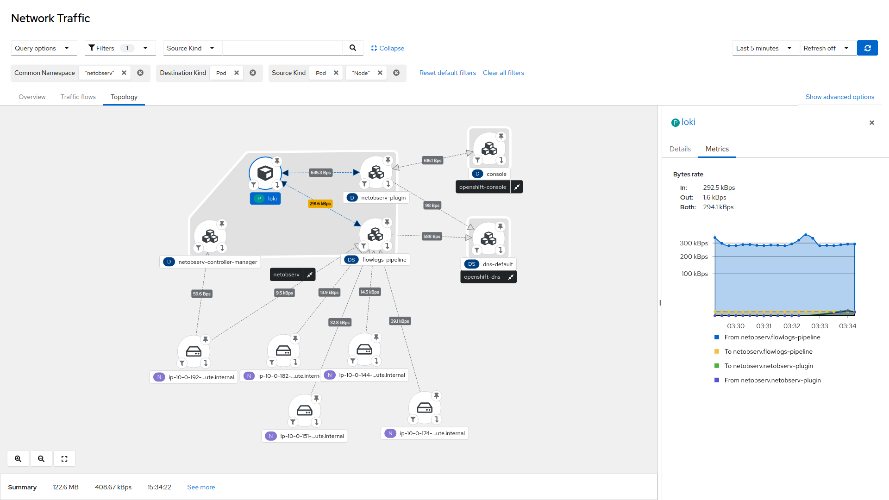

# NetObserv Operator

NetObserv Operator is a Kubernetes / OpenShift operator for network observability. It deploys a monitoring pipeline to collect and enrich network flows. These flows can be produced by the NetObserv eBPF agent, or by any device or CNI able to export flows in IPFIX format, such as OVN-Kubernetes.

The operator provides dashboards, metrics, and keeps flows accessible in a queryable log store, Grafana Loki. When used in OpenShift, new dashboards are available in the Console.

## Getting Started

You can install NetObserv Operator using [OLM](https://olm.operatorframework.io/) if it is available in your cluster, or directly from its repository.

### Install with OLM

NetObserv Operator is available in [OperatorHub](https://operatorhub.io/operator/netobserv-operator) with guided steps on how to install this. It is also available in the OperatorHub catalog directly in the OpenShift Console.


Please read the operator description. You will need to install Loki, some instructions are provided there.

After the operator is installed, create a `FlowCollector` resource:


Refer to the [Configuration section](#configuration) of this document.

### Install from repository

A couple of `make` targets are provided in this repository to allow installing without OLM:

```bash
git clone https://github.com/netobserv/network-observability-operator.git && cd network-observability-operator
make deploy deploy-loki deploy-grafana
```

It will deploy the operator in its latest version, with port-forwarded Loki and Grafana.

> Note: the `loki-deploy` script is provided as a quick install path and is not suitable for production. It deploys a single pod, configures a 1GB storage PVC, with 24 hours of retention. For a scalable deployment, please refer to [our distributed Loki guide](https://github.com/netobserv/documents/blob/main/loki_distributed.md) or [Grafana's official documentation](https://grafana.com/docs/loki/latest/).

To deploy the monitoring pipeline, this `make` target installs a `FlowCollector` with default values:

```bash
make deploy-sample-cr
```

Alternatively, you can [grab and edit](./config/samples/flows_v1alpha1_flowcollector.yaml) this config before installing it.

You can still edit the `FlowCollector` after it's installed: the operator will take care about reconciling everything with the updated configuration:

```bash
kubectl edit flowcollector cluster
```

Refer to the [Configuration section](#configuration) of this document.

#### Install older versions

To deploy a specific version of the operator, you need to switch to the related git branch, then add a `VERSION` env to the above make command, e.g:

```bash
git checkout 0.1.2
VERSION=0.1.2 make deploy deploy-loki deploy-grafana
kubectl apply -f ./config/samples/flows_v1alpha1_flowcollector_versioned.yaml
```

Beware that the version of the underlying components, such as flowlogs-pipeline, may be tied to the version of the operator (this is why we recommend switching the git branch). Breaking this correlation may result in crashes. The versions of the underlying components are defined in the `FlowCollector` resource as image tags.

### OpenShift Console

_Pre-requisite: OpenShift 4.10 or above_

If the OpenShift Console is detected in the cluster, a console plugin is deployed when a `FlowCollector` is installed. It adds new pages and tabs to the console:

- A flow table, with powerful filtering and display options


- A network topology, with the same filtering options and several levels of aggregations (nodes, namespaces, owner controllers, pods). A side panel provides contextual insight and metrics.



These components are accessible directly from the main menu, and also as contextual tabs for any Pod, Deployment, Service (etc.) in their details page.


### Standalone console

_Coming soon_

### Grafana

Grafana can be used to retrieve and show the collected flows from Loki. If you used the `make` commands provided above to install NetObserv from the repository, you should already have Grafana installed and configured with Loki data source. Otherwise, you can install Grafana by following the instructions [here](https://github.com/netobserv/documents/blob/main/hack_loki.md#grafana), and add a new Loki data source that matches your setup. If you used the provided quick install path for Loki, its access URL is `http://loki:3100`.

To get dashboards, import [this file](./config/samples/dashboards/Network%20Observability.json) into Grafana. It includes a table of the flows and some graphs showing the volumetry per source or destination namespaces or workload:


## Configuration

The `FlowCollector` resource is used to configure the operator and its managed components. A comprehensive documentation is [available here](./docs/FlowCollector.md), and a full sample file [there](./config/samples/flows_v1alpha1_flowcollector.yaml).

To edit configuration in cluster, run:

```bash
kubectl edit flowcollector cluster
```

As it operates cluster-wide, only a single `FlowCollector` is allowed, and it has to be named `cluster`.

A couple of settings deserve special attention:

- Agent (`spec.agent.type`) can be `EBPF` (default) or `IPFIX`. eBPF is recommended, as it should work in more situations and offers better performances. If you can't, or don't want to use eBPF, note that the IPFIX option is fully functional only when using OVN-Kubernetes CNI. Other CNIs are not officially supported, but you may still be able to configure them manually if they allow IPFIX exports.

- Sampling (`spec.agent.ebpf.sampling` and `spec.agent.ipfix.sampling`): 24/7, 1:1 sampled flow collection may consume a non-negligible amount of resources. While we are doing our best to make it a viable option in production, it is still sometimes necessary to mitigate by setting a sampling ratio. A value of `100` means: one flow every 100 is sampled. `1` means all flows are sampled. The lower it is, the more flows you get, and the more accurate are derived metrics. By default, sampling is set to 50 (ie. 1:50) for eBPF and 400 (1:400) for IPFIX. Note that more sampled flows also means more storage needed. We recommend to start with default values and refine empirically, to figure out which setting your cluster can manage.

- Loki (`spec.loki`): configure here how to reach Loki. The default values match the Loki quick install paths mentioned in the _Getting Started_ section, but you may have to configure differently if you used another installation method.

- Kafka (`spec.kafka`): when enabled, integrate the flow collection pipeline with Kafka, by splitting ingestion from transformation (kube enrichment, derived metrics, ...). Kafka can provide better scalability, resiliency and high availability ([view more details](https://www.redhat.com/en/topics/integration/what-is-apache-kafka)). Assumes Kafka is already deployed and a topic is created. For convenience, we provide a quick deployment using [strimzi](https://strimzi.io/): run `make deploy-kafka` from the repository.

## Development & building from sources

Please refer to [this documentation](./DEVELOPMENT.md) for everything related to building, deploying or bundling from sources.

## F.A.Q / Troubleshooting

If you can't find help here, don't hesitate to open [an issue](https://github.com/netobserv/network-observability-operator/issues) or a [Q&A](https://github.com/netobserv/network-observability-operator/discussions/categories/q-a). There are several repositories under _netobserv_ github org, but it is fine to centralize these in _network-observability-operator_.

### Is it for OpenShift only?

No! While some features are developed primarily for OpenShift, we want to keep it on track with other / "vanilla" Kubes. For instance, there has been some work to make the console plugin [run as a standalone](https://github.com/netobserv/network-observability-console-plugin/pull/163), or the operator to manage upstream (non-OpenShift) [ovn-kubernetes](https://github.com/netobserv/network-observability-operator/pull/97).

And if something is not working as hoped with your setup, you are welcome to contribute to the project ;-)

### Which version of Kubernetes / OpenShift is supported?

It depends on which `agent` you want to use: `ebpf` or `ipfix`, and whether you want to get the OpenShift Console plugin.

#### To run the eBPF agent

What matters is the version of the Linux kernel: 4.18 or more is supported. Earlier versions are not tested.

Other than that, there are no known restrictions on the Kubernetes version.

#### To use IPFIX exports

OpenShift 4.10 or above, or upstream OVN-Kubernetes, are recommended, as the operator will configure OVS for you.

For other CNIs, you need to find out if they can export IPFIX, and configure them accordingly.

#### To get the OpenShift Console plugin

OpenShift 4.10 or above is required.

### How can I make sure everything is correctly deployed?

Make sure all pods are up and running:

```bash
# Assuming configured namespace is netobserv (default)
kubectl get pods -n netobserv
```

Should provide results similar to this:

```
NAME                                            READY   STATUS    RESTARTS   AGE
flowlogs-pipeline-5rrg2                         1/1     Running   0          43m
flowlogs-pipeline-cp2lb                         1/1     Running   0          43m
flowlogs-pipeline-hmwxd                         1/1     Running   0          43m
flowlogs-pipeline-wmx4z                         1/1     Running   0          43m
grafana-6dbddc9869-sxn62                        1/1     Running   0          31m
loki                                            1/1     Running   0          43m
netobserv-controller-manager-7487d87dc-2ltq2    2/2     Running   0          43m
netobserv-plugin-7fb8c5477b-drg2z               1/1     Running   0          43m
```

Results may slightly differ depending on the installation method and the `FlowCollector` configuration. At least you should see `flowlogs-pipeline` pods in a `Running` state.

If you use the eBPF agent, check also for pods in privileged namespace:

```bash
# Assuming configured namespace is netobserv (default)
kubectl get pods -n netobserv-privileged
```

```
NAME                         READY   STATUS    RESTARTS   AGE
netobserv-ebpf-agent-7rwtk   1/1     Running   0          7s
netobserv-ebpf-agent-c7nkv   1/1     Running   0          7s
netobserv-ebpf-agent-hbjz8   1/1     Running   0          7s
netobserv-ebpf-agent-ldj66   1/1     Running   0          7s

```

Finally, make sure Loki is correctly deployed, and reachable from pods via the URL defined in `spec.loki.url`. You can for instance check using this command:

```bash
kubectl exec $(kubectl get pod -l "app=flowlogs-pipeline" -o name)  -- curl  -G -s "`kubectl get flowcollector cluster -o=jsonpath={.spec.loki.url}`loki/api/v1/query" --data-urlencode 'query={app="netobserv-flowcollector"}' --data-urlencode 'limit=1'
```

It should return some json in this form:

```
{"status":"success","data":{"resultType":"streams","result":[...],"stats":{...}}}
```

### Everything seems correctly deployed but there isn't any flow showing up

If using IPFIX (ie. `spec.agent.type` is `IPFIX` in FlowCollector), wait 10 minutes and check again. There is sometimes a delay, up to 10 minutes, before the flows appear. This is due to the IPFIX protocol requiring exporter and collector to exchange record template definitions as a preliminary step. The eBPF agent doesn't have such a delay.

Else, check for any suspicious error in logs, especially in the `flowlogs-pipeline` pods and the eBPF agent pods. You may also take a look at prometheus metrics prefixed with `netobserv_`: they can give you clues if flows are processed, if errors are reported, etc.

Finally, don't hesitate to [open an issue](https://github.com/netobserv/network-observability-operator/issues).

### There is no Network Traffic menu entry in OpenShift Console

Make sure your cluster version is at least OpenShift 4.10: prior versions have no (or incompatible) console plugin SDK.

Make sure that `spec.consolePlugin.register` is set to `true` (default).

If not, or if for any reason the registration seems to have failed, you can still do it manually by editing the Console Operator config:

```bash
kubectl edit console.operator.openshift.io cluster
```

If it's not already there, add the plugin reference:

```yaml
spec:
  plugins:
  - netobserv-plugin
```

If the new dashboards still don't show up, try clearing your browser cache and refreshing. Check also the `netobserv-console-plugin-...` pod status and logs.

```bash
kubectl get pods -n netobserv -l app=netobserv-plugin
kubectl logs -n netobserv -l app=netobserv-plugin
```

### I first deployed flowcollector, and then kafka. Flowlogs-pipeline is not consuming any flow from Kafka

This is a [known bug](https://github.com/segmentio/kafka-go/issues/1044) in one of flowlogs-pipeline dependencies.

Please recreate the flowlogs-pipeline pods by either killing them maunally or deleting and recreating the flow collector object.

## Contributions

This project is licensed under [Apache 2.0](./LICENSE) and accepts contributions via GitHub pull requests. Other related `netobserv` projects follow the same rules:
- [Flowlogs-pipeline](https://github.com/netobserv/flowlogs-pipeline)
- [eBPF agent](https://github.com/netobserv/netobserv-ebpf-agent)
- [OpenShift Console plugin](https://github.com/netobserv/network-observability-console-plugin)

External contributions are welcome and can take various forms:

- Providing feedback, by starting [discussions](https://github.com/netobserv/network-observability-operator/discussions) or opening [issues](https://github.com/netobserv/network-observability-operator/issues).
- Code / doc contributions. You will [find here](./DEVELOPMENT.md) some help on how to build, run and test your code changes. Don't hesitate to [ask for help](https://github.com/netobserv/network-observability-operator/discussions/categories/q-a).
