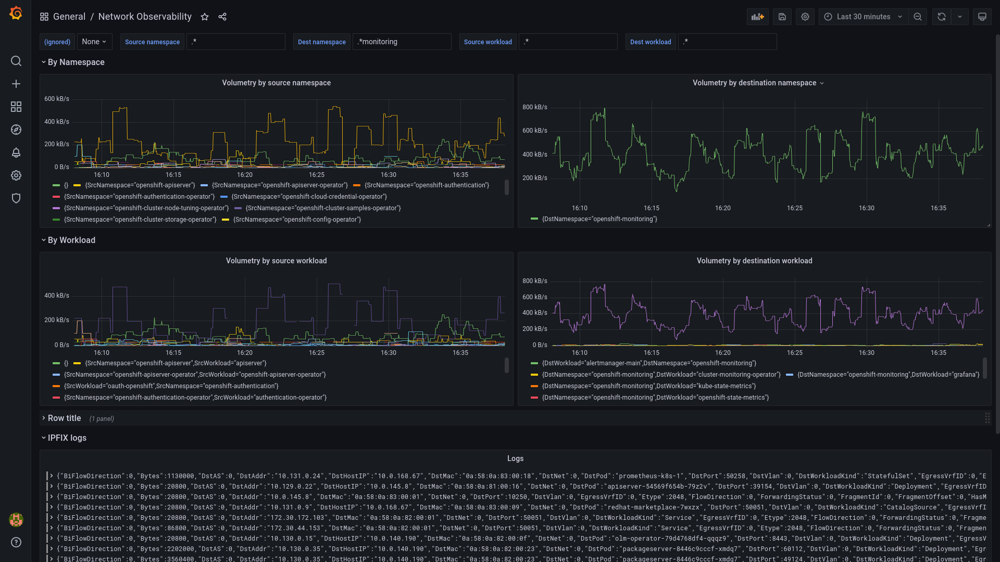

# NetObserv Operator

NetObserv Operator is a Kubernetes / OpenShift operator for network observability. It deploys a flow monitoring pipeline to collect network flows exported by an eBPF agent or by a device such as an [Open vSwitch](https://www.openvswitch.org/) (OVS), in IPFIX format.

It provides dashboards, metrics, and keeps flows accessible in a queryable log store: [Grafana Loki](https://grafana.com/oss/loki/). When used in OpenShift, new dashboards are available in the Console.

## Getting Started

You can install NetObserv Operator using [OLM](https://olm.operatorframework.io/) if it is available in your cluster, or directly from its repository.

### Install with OLM

NetObserv Operator is available in [OperatorHub](https://operatorhub.io/operator/netobserv-operator) with guided steps on how to install this. It is also available in the OperatorHub catalog directly in the OpenShift Console.


After the operator is installed, create a `FlowCollector` resource:


> Note: by default, NetObserv configures [OVN-Kubernetes](https://github.com/ovn-org/ovn-kubernetes/) for IPFIX exports. If you are not using OVN-Kubernetes as your CNI, then configure `FlowCollector` to use the eBPF agent instead, unless you have a device such as an OVS in your network that you want to export IPFIX flows. To use the eBPF agent, set `Agent` to `ebpf`.

Refer to the [Configuration section](#configuration) of this document.

### Install from repository

A couple of `make` targets are provided in this repository to allow installing without OLM:

```bash
git clone https://github.com/netobserv/network-observability-operator.git && cd network-observability-operator
make deploy deploy-loki deploy-grafana
```

It will deploy the operator in its latest version, with port-forwarded Loki and Grafana.

> Note: the `loki-deploy` script is provided as a quick install path and is not suitable for production. Please refer to [the official documentation](https://grafana.com/docs/loki/latest/) for a clean install.

To deploy the monitoring pipeline, this `make` target installs a `FlowCollector` with default values:

```bash
make deploy-sample-cr
```

Alternatively, you can [grab and edit](./config/samples/flows_v1alpha1_flowcollector.yaml) this config before installing it.

> Note: by default, NetObserv configures [OVN-Kubernetes](https://github.com/ovn-org/ovn-kubernetes/) for IPFIX exports. If you are not using OVN-Kubernetes as your CNI, then configure `FlowCollector` to use the eBPF agent instead, unless you have a device such as an OVS in your network that you want to export IPFIX flows. To use the eBPF agent, set `spec.agent` to `ebpf`.

You can still edit the `FlowCollector` after it's installed: the operator will take care about reconciling everything with the updated configuration:

```bash
kubectl edit flowcollector cluster
```

Refer to the [Configuration section](#configuration) of this document.

#### Install older versions

To deploy a specific version of the operator, you need to switch to the related git branch, then add a `VERSION` env to the above make command, e.g:

```bash
git checkout 0.1.2
VERSION=0.1.2 make deploy deploy-loki deploy-grafana
kubectl apply -f ./config/samples/flows_v1alpha1_flowcollector_versioned.yaml
```

Beware that the version of the underlying components, such as flowlogs-pipeline, may be tied to the version of the operator (this is why we recommend switching the git branch). Breaking this correlation may result in crashes. The versions of the underlying components are defined in the `FlowCollector` resource as image tags.

### OpenShift Console

_Pre-requisite: OpenShift 4.10 or above_

If the OpenShift Console is detected in the cluster, a console plugin is deployed when a `FlowCollector` is installed. It adds new views to the console:

- A flow table, with powerful filtering and display options


- A topology view, with the same filtering options and several levels of aggregations (nodes, namespaces, owner controllers, pods). A side panel provides contextual insight and metrics.


These views are accessible directly from the main menu, and also as contextual tabs for any Pod, Deployment, Service (etc.) in their details page.


### Standalone console

_Coming soon_

### Grafana

Grafana can be used to retrieve and show the collected flows from Loki. If you used the `make` commands provided above to install NetObserv from the repository, you should already have Grafana installed and configured with Loki data source. Otherwise, you can install Grafana by following the instructions [here](https://github.com/netobserv/documents/blob/main/hack_loki.md#grafana), and add a new Loki data source that matches your setup. If you used the provided quick install path for Loki, its access URL is `http://loki:3100`.

To get dashboards, import [this file](./config/samples/dashboards/Network%20Observability.json) into Grafana. It includes a table of the flows and some graphs showing the volumetry per source or destination namespaces or workload:



## Configuration

The `FlowCollector` resource is used to configure the operator and its managed components. A comprehensive documentation is [available here](./docs/FlowCollector.md), and a full sample file [there](./config/samples/flows_v1alpha1_flowcollector.yaml).

To edit configuration in cluster, run:

```bash
kubectl edit flowcollector cluster
```

As it operates cluster-wide, only a single `FlowCollector` is allowed, and it has to be named `cluster`.

A couple of settings deserve special attention:

- Agent (`spec.agent`) can be `ipfix` or `ebpf`. As mentioned above, the IPFIX option is fully functional when using OVN-Kubernetes CNI.  Other CNIs are not supported, but you may still be able to configure them manually if they allow IPFIX exports, whereas eBPF is expected to work regardless of the running CNI.

- Sampling (`spec.ipfix.sampling` and `spec.ebpf.sampling`): 24/7 unsampled flow collection may consume a non-negligible amount of resources. While we are doing our best to make it a viable option in production, it is still often necessary to mitigate by setting a sampling ratio. A value of `100` means: one flow every 100 is sampled. `1` means no sampling. The lower it is, the more accurate are flows and derived metrics. By default, sampling is set to 400 for IPFIX, and is disabled for eBPF.

- Loki (`spec.loki`): configure here how to reach Loki. The default values match the Loki quick install paths mentioned in the _Getting Started_ section, but you may have to configure differently if you used another installation method.

- Kafka (`spec.kafka`): _experimental_ - when enabled, integrate the flow collection pipeline with Kafka, by splitting ingestion from transformation (kube enrichment, derived metrics, ...). Assumes Kafka is already deployed and a topic is created. For convenience, we provide a quick deployment using [strimzi](https://strimzi.io/): run `make deploy-kafka` from the repository.

## Development & building from sources

Please refer to [this documentation](./DEVELOPMENT.md) for everything related to building, deploying or bundling from sources.

## F.A.Q / Troubleshooting

If you can't find help here, don't hesitate to open [an issue](https://github.com/netobserv/network-observability-operator/issues) or a [Q&A](https://github.com/netobserv/network-observability-operator/discussions/categories/q-a). There are several repositories under _netobserv_ github org, but it is fine to centralize these in _network-observability-operator_.

### Is it for OpenShift only?

No! While some features are developed primarily for OpenShift, we want to keep it on track with other / "vanilla" Kubes. For instance, there has been some work to make the console plugin [run as a standalone](https://github.com/netobserv/network-observability-console-plugin/pull/163), or the operator to manage upstream (non-OpenShift) [ovn-kubernetes](https://github.com/netobserv/network-observability-operator/pull/97).

And if something is not working as hoped with your setup, you are welcome to contribute to the project ;-)

### Which version of Kubernetes / OpenShift is supported?

It depends on which `agent` you want to use: `ebpf` or `ipfix`, and whether you want to get the OpenShift Console plugin.

#### To run the eBPF agent

What matters is the version of the Linux kernel: 4.18 or more is supported. Earlier versions are not tested.

Other than that, there are no known restrictions yet on the Kubernetes version.

#### To use IPFIX exports

OpenShift 4.10 or above, or upstream OVN-Kubernetes, are recommended, as the operator will configure OVS for you. Otherwise, you need to configure it manually.

For OpenShift 4.8 or 4.9:

* Configure `spec.flowlogsPipeline.kind` to be `Deployment`
* Run the following:

```bash
FLP_IP=`kubectl get svc flowlogs-pipeline -n network-observability -ojsonpath='{.spec.clusterIP}'` && echo $FLP_IP
kubectl patch networks.operator.openshift.io cluster --type='json' -p "[{'op': 'add', 'path': '/spec', 'value': {'exportNetworkFlows': {'ipfix': { 'collectors': ['$FLP_IP:2055']}}}}]"
```

OpenShift versions older than 4.8 don't support IPFIX exports.

For other CNIs, you need to find out if they can export IPFIX, and configure them accordingly.

#### To get the OpenShift Console plugin

OpenShift 4.10 or above is required.

### How can I make sure everything is correctly deployed?

Make sure all pods are up and running:

```bash
# Assuming configured namespace is network-observability (default)
kubectl get pods -n network-observability
```

Should provide results similar to this:

```
NAME                                            READY   STATUS    RESTARTS   AGE
flowlogs-pipeline-5rrg2                         1/1     Running   0          43m
flowlogs-pipeline-cp2lb                         1/1     Running   0          43m
flowlogs-pipeline-hmwxd                         1/1     Running   0          43m
flowlogs-pipeline-wmx4z                         1/1     Running   0          43m
grafana-6dbddc9869-sxn62                        1/1     Running   0          31m
loki                                            1/1     Running   0          43m
netobserv-controller-manager-7487d87dc-2ltq2    2/2     Running   0          43m
network-observability-plugin-7fb8c5477b-drg2z   1/1     Running   0          43m
```

Results may slightly differ depending on the installation method and the `FlowCollector` configuration. At least you should see `flowlogs-pipeline` pods in a `Running` state.

If you use the eBPF agent in privileged mode (`spec.ebpf.privileged=true`), check also for pods in privileged namespace:

```bash
# Assuming configured namespace is network-observability (default)
kubectl get pods -n network-observability-privileged
```

```
NAME                         READY   STATUS    RESTARTS   AGE
netobserv-ebpf-agent-7rwtk   1/1     Running   0          7s
netobserv-ebpf-agent-c7nkv   1/1     Running   0          7s
netobserv-ebpf-agent-hbjz8   1/1     Running   0          7s
netobserv-ebpf-agent-ldj66   1/1     Running   0          7s

```

Finally, make sure Loki is correctly deployed, and reachable from pods via the URL defined in `spec.loki.url`.

### Everything seems correctly deployed but there isn't any flow showing up

Wait 10 minutes and check again. When `spec.agent` is `ipfix`, there is sometimes a delay, up to 10 minutes, before the flows appear. This is due to the IPFIX protocol requiring exporter and collector to exchange record template definitions as a preliminary step. The eBPF agent doesn't have such a delay.

### There is no Network Traffic menu entry in OpenShift Console

Make sure your cluster version is at least OpenShift 4.10: prior versions have no (or incompatible) console plugin SDK.

Make sure that `spec.consolePlugin.register` is set to `true` (default).

If not, or if for any reason the registration seems to have failed, you can still do it manually by editing the Console Operator config:

```bash
kubectl edit console.operator.openshift.io cluster
```

If it's not already there, add the plugin reference:

```yaml
spec:
  plugins:
  - network-observability-plugin
```

If the new dashboards still don't show up, try clearing your browser cache and refreshing. Check also the `netobserv-console-plugin-...` pod status and logs.

```bash
kubectl get pods -n network-observability -l app=network-observability-plugin
kubectl logs -n network-observability -l app=network-observability-plugin
```

## Contributions

This project is licensed under [Apache 2.0](./LICENSE) and accepts contributions via GitHub pull requests. Other related `netobserv` projects follow the same rules:
- [Flowlogs-pipeline](https://github.com/netobserv/flowlogs-pipeline)
- The [eBPF agent](https://github.com/netobserv/netobserv-ebpf-agent)
- [OpenShift Console plugin](https://github.com/netobserv/network-observability-console-plugin)

External contributions are welcome and can take various forms:

- Providing feedback, by starting [discussions](https://github.com/netobserv/network-observability-operator/discussions) or opening [issues](https://github.com/netobserv/network-observability-operator/issues).
- Code / doc contributions. You will [find here](./DEVELOPMENT.md) some help on how to build, run and test your code changes. Don't hesitate to [ask for help](https://github.com/netobserv/network-observability-operator/discussions/categories/q-a).
