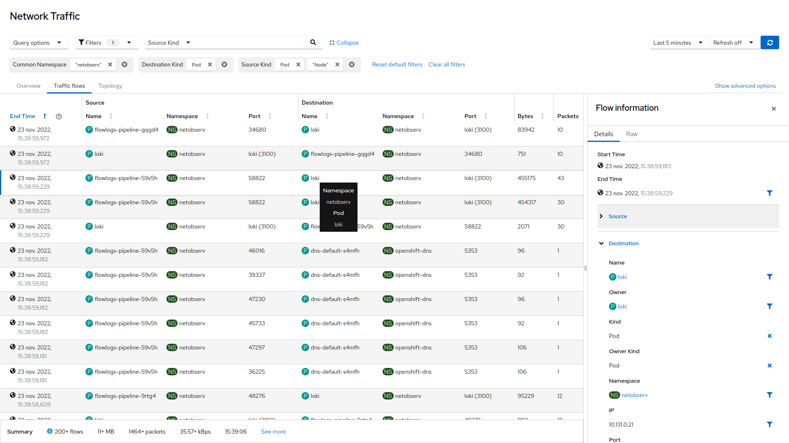

# NetObserv Operator


[](https://artifacthub.io/packages/helm/netobserv/netobserv-operator)
[](https://goreportcard.com/report/github.com/netobserv/network-observability-operator)

NetObserv Operator is a Kubernetes operator for network observability. It deploys a monitoring pipeline that consists in:
- An eBPF agent, that generates network flows from captured packets.
- Flowlogs-pipeline, a component that collects, enriches and exports these flows.
- A web console for flows visualization with powerful filtering options, a topology representation, a network health view, etc.

Flow data is then available in multiple ways, each optional:

- As Prometheus metrics.
- As raw flow logs stored in Loki.
- As raw flow logs exported to a collector via Kafka, OpenTelemetry or IPFIX.

## Getting Started

You can install the NetObserv Operator using [Helm](https://helm.sh/), or directly from sources.

> [!TIP]
NetObserv can be used in downstream products, which may provide their own documentation. If you are using such a product, please refer to that documentation instead:
> 
> - On OpenShift: [see Network Observability operator](https://docs.redhat.com/en/documentation/openshift_container_platform/latest/html/network_observability/installing-network-observability-operators).

### Pre-requisite

The following architectures are supported: _amd64_, _arm64_, _ppc64le_ and _s390x_.

NetObserv has a couple of dependencies that must be installed on your cluster:

- Cert-manager
- Prometheus
- Loki

Cert-manager has to be installed separately. For example, using helm:

```bash
helm repo add cert-manager https://charts.jetstack.io
helm install my-cert-manager cert-manager/cert-manager --set crds.enabled=true
```

Prometheus and Loki can be installed separately, or as dependencies of NetObserv (see below).

Loki is not mandatory but improves the overall experience with NetObserv.

### Install with Helm

> [!TIP]
> See it also on [ArtifactHub](https://artifacthub.io/packages/helm/netobserv/netobserv-operator).

```bash
helm repo add netobserv https://netobserv.io/static/helm/ --force-update

# Standalone install, including dependencies:
helm install my-netobserv -n netobserv --create-namespace --set install.loki=true --set install.prom-stack=true netobserv/netobserv-operator

# OR minimal install (Prometheus/Loki must be installed separately)
helm install my-netobserv -n netobserv --create-namespace netobserv/netobserv-operator
```

You can now create a `FlowCollector` resource. Refer to the [Configuration section](#configuration) of this document. A short `FlowCollector` should work, using most default values, plus with the standalone console enabled:

```bash
cat <<EOF | kubectl apply -f -
apiVersion: flows.netobserv.io/v1beta2
kind: FlowCollector
metadata:
  name: cluster
spec:
  namespace: netobserv
  networkPolicy:
    enable: false
  consolePlugin:
    standalone: true
  processor:
    advanced:
      env:
        SERVER_NOTLS: "true"
  loki:
    mode: Monolithic
    monolithic:
      url: 'http://my-netobserv-loki.netobserv.svc.cluster.local.:3100/'
  prometheus:
    querier:
      mode: Manual
      manual:
        url: http://my-netobserv-kube-promethe-prometheus.netobserv.svc.cluster.local.:9090/
        alertManager:
          url: http://my-netobserv-kube-promethe-alertmanager.netobserv.svc.cluster.local.:9093/
EOF
```

A few remarks:
- You can change the Prometheus and Loki URLs depending on your installation. This example works if you use the "standalone" installation described above, with `install.loki=true` and `install.prom-stack=true`. Check more configuration options for [Prometheus](https://github.com/netobserv/network-observability-operator/blob/main/docs/FlowCollector.md#flowcollectorspecprometheus-1) and [Loki](https://github.com/netobserv/network-observability-operator/blob/main/docs/FlowCollector.md#flowcollectorspecloki-1).
- You can enable networkPolicy, which makes the operator lock down the namespaces that it manages; however, this is highly dependent on your cluster topology, and may cause malfunctions, such as preventing NetObserv pods from communicating with the Kube API server.
- The processor env `SERVER_NOTLS` means that the communication between eBPF agents and Flowlogs-pipeline won't be encrypted. To enable TLS, you need to supply the TLS certificates to Flowlogs-pipeline (a Secret named `flowlogs-pipeline-cert`), and the CA to the eBPF agents (a ConfigMap named `flowlogs-pipeline-ca` in the privileged namespace). [Check this issue](https://github.com/netobserv/network-observability-operator/issues/2360) if you want to help making it simpler.

To view the test console, you can port-forward 9001:

```bash
kubectl port-forward svc/netobserv-plugin 9001:9001 -n netobserv
```

Then open http://localhost:9001/ in your browser.

### Install from repository

A couple of `make` targets are provided in this repository to allow installing without OLM:

```bash
git clone https://github.com/netobserv/network-observability-operator.git && cd network-observability-operator
USER=netobserv make deploy deploy-loki deploy-grafana
```

It will deploy the operator in its latest version, with port-forwarded Loki and Grafana (they are optional).

> Note: the `loki-deploy` script is provided as a quick install path and is not suitable for production. It deploys a single pod, configures a 10GB storage PVC, with 24 hours of retention. For a scalable deployment, please refer to [our distributed Loki guide](https://github.com/netobserv/documents/blob/main/loki_distributed.md) or [Grafana's official documentation](https://grafana.com/docs/loki/latest/).

To deploy the monitoring pipeline, this `make` target installs a `FlowCollector` with default values:

```bash
make deploy-sample-cr
```

Alternatively, you can [grab and edit](./config/samples/flows_v1beta2_flowcollector.yaml) this config before installing it.

You can still edit the `FlowCollector` after it's installed: the operator will take care about reconciling everything with the updated configuration:

```bash
kubectl edit flowcollector cluster
```

Refer to the [Configuration section](#configuration) of this document.

### With or without Loki?

Historically, Grafana Loki was a strict dependency but it isn't anymore. If you don't want to install it, you can still get the Prometheus metrics, and/or export raw flows to a custom collector. But be aware that some of the Console plugin features will be disabled. For instance, you will not be able to view raw flows there, and the metrics / topology will have a more limited level of details, missing information such as pods or IPs.

### Web Console

When `FlowCollector` is installed, a standalone web console is deployed or, when available, a console plugin. It provides the following views:

#### Overview metrics

Charts on this page show overall, aggregated metrics on the cluster network. The stats can be refined with comprehensive filtering and display options. Different levels of aggregations are available: per zone, per node, per namespace, per owner or per pod/service. For instance, it allows to identify biggest talkers in different contexts: top X inter-namespace flows, or top X pod-to-pod flows within a namespace, etc.

The watched time interval can be adjusted, as well as the refresh frequency, hence you can get an almost live view on the cluster traffic. This also applies to the other pages described below.


#### Topology

The topology view represents traffic between elements as a graph. The same filtering and aggregation options as described above are available, plus extra display options e.g. to group element by node, namespaces, etc. A side panel provides contextual information and metrics related to the selected element.


_This screenshot shows the NetObserv architecture itself: Nodes (via eBPF agents) sending traffic (flows) to the collector flowlogs-pipeline, which in turn sends data to Loki. The NetObserv console plugin fetches these flows from Loki._

#### Flow table

The table view shows raw flows, ie. non aggregated, still with the same filtering options, and configurable columns.



## Configuration

The `FlowCollector` resource is used to configure the operator and its managed components. A comprehensive documentation is [available here](./docs/FlowCollector.md), and a full sample file [there](./config/samples/flows_v1beta2_flowcollector.yaml).

To edit configuration in cluster, run:

```bash
kubectl edit flowcollector cluster
```

As it operates cluster-wide on every node, only a single `FlowCollector` is allowed, and it has to be named `cluster`.

A couple of settings deserve special attention:

- Agent features (`spec.agent.ebpf.features`) can enable more features such as tracking packet drops, TCP latency (RTT) and DNS requests and responses.

- Sampling `spec.agent.ebpf.sampling`: a value of `100` means: one packet every 100 is sampled. `1` means all packets are sampled. The lower it is, the more flows you get, and the more accurate are derived metrics, but the higher amount of resources are consumed. By default, sampling is set to 50 (ie. 1:50). Note that more sampled packets also means more storage needed. We recommend to start with default values and refine empirically, to figure out which setting your cluster can manage.

- Loki (`spec.loki`): configure here how to reach Loki. The default URL values match the Loki quick install paths mentioned in the _Getting Started_ section, but you may have to configure differently if you used another installation method. You will find more information in our guides for deploying Loki: [with Loki Operator](https://github.com/netobserv/documents/blob/main/loki_operator.md), or an alternative ["distributed Loki" guide](https://github.com/netobserv/documents/blob/main/loki_distributed.md). You should set `spec.loki.mode` according to the chosen installation method, for instance use `LokiStack` if you use the Loki Operator. Make sure to disable Loki (`spec.loki.enable`) if you don't want to use it.

- Quick filters (`spec.consolePlugin.quickFilters`): configure preset filters to be displayed in the Console plugin. They offer a way to quickly switch from filters to others, such as showing / hiding pods network, or infrastructure network, or application network, etc. They can be tuned to reflect the different workloads running on your cluster. For a list of available filters, [check this page](./docs/QuickFilters.md).

- Kafka (`spec.deploymentModel: Kafka` and `spec.kafka`): when enabled, integrates the flow collection pipeline with Kafka, by splitting ingestion from transformation (kube enrichment, derived metrics, ...). Kafka can provide better scalability, resiliency and high availability. It's also an option to consider when you have a bursty traffic. [This page](https://www.redhat.com/en/topics/integration/what-is-apache-kafka) provides some guidance on why to use Kafka. When configured to use Kafka, NetObserv operator assumes it is already deployed and a topic is created. For convenience, we provide a quick deployment using [Strimzi](https://strimzi.io/): run `make deploy-kafka` from the repository.

- Exporters (`spec.exporters`) an optional list of exporters to which to send enriched flows. Currently, KAFKA and IPFIX are available (only KAFKA being actively maintained). This allows you to define any custom storage or processing that can read from Kafka or from an IPFIX collector.

- To enable availability zones awareness, set `spec.processor.addZone` to `true`.

### Metrics

More information on Prometheus metrics is available in a dedicated page: [Metrics.md](./docs/Metrics.md).

### Performance fine-tuning

In addition to sampling and using Kafka or not, other settings can help you get an optimal setup, with or without compromising on the observability.

Here is what you should pay attention to:

- eBPF agent's cache eviction interval (`spec.agent.ebpf.cacheActiveTimeout`) controls how often flows are reported by the agents. The higher it is, the more aggregated the flows are, which results in less traffic sent by the agents themselves, and also ties with less CPU load. But on the flip side, it leads to a slightly higher memory consumption in the agent, and generates more latency in the flow collection. It must be configured in relation with the max flows parameters (`spec.agent.ebpf.cacheMaxFlows`), which defines the size of the eBPF data structures, to make sure there is always enough room for new flows. There is [a blog entry](https://netobserv.io/posts/performance-fine-tuning-a-deep-dive-in-ebpf-agent-metrics/) dedicated to this tuning.

- It is possible to reduce the overall observed traffic by restricting or excluding interfaces via `spec.agent.ebpf.interfaces` and `spec.agent.ebpf.excludeInterfaces`. Note that the interface names may vary according to the CNI used.

- You can also add [eBPF filters](https://netobserv.io/posts/enhancing-netobserv-by-introducing-multi-rules-flow-filtering-capability-in-ebpf/) and [flowlogs-pipeline filters](https://github.com/netobserv/flowlogs-pipeline/blob/main/docs/filtering.md) to further narrow down what's being collected, if you find that you don't need every kind of flows. The former has the greatest impact on the performance of each component, while the latter mainly improves the storage/Loki end of the pipeline.

- Resource requirements and limits (`spec.agent.ebpf.resources`, `spec.agent.processor.resources`): adapt the resource requirements and limits to the load and memory usage you expect on your cluster. The default limits (800MB) should be sufficient for most medium sized clusters. You can read more about reqs and limits [here](https://kubernetes.io/docs/concepts/configuration/manage-resources-containers/).

- Each component offers more advanced settings via `spec.agent.ebpf.advanced`, `spec.processor.advanced`, `spec.loki.advanced` and `spec.consolePlugin.advanced`. The agent has [environment variables](https://github.com/netobserv/netobserv-ebpf-agent/blob/main/docs/config.md) that you can set through `spec.agent.ebpf.advanced.env`.

#### Loki

The `FlowCollector` resource includes configuration of the Loki client, which is used by the processor (`flowlogs-pipeline`) to connect and send data to Loki for storage. They impact two things: batches and retries.

- `spec.loki.writeBatchWait` and `spec.loki.writeBatchSize` control the batching mechanism, ie. how often data is flushed out to Loki. Like in the eBPF agent batching, higher values will generate fewer traffic and consume less CPU, however it will increase a bit the memory consumption of `flowlogs-pipeline`, and may increase a bit collection latency.

- `spec.loki.advanced.writeMinBackoff`, `spec.loki.writeMaxBackoff` and `spec.loki.writeMaxRetries` control the retry mechanism. Retries may happen when Loki is unreachable or when it returns errors. Often, it is due to the rate limits configured on Loki server. When such situation occurs, it might not always be the best solution to increase rate limits (on server configuration side) or to increase retries. Increasing rate limits will put more pressure on Loki, so expect more memory and CPU usage, and also more traffic. Increasing retries will put more pressure on `flowlogs-pipeline`, as it will retain data for longer and accumulate more flows to send. When all the retry attempts fail, flows are simply dropped. Flow drops are counted in the metric `netobserv_loki_dropped_entries_total`.

On the Loki server side, configuration differs depending on how Loki was installed, e.g. via Helm chart, Loki Operator, etc. Nevertheless, here are a couple of settings that may impact the flow processing pipeline:

- Rate limits ([cf Loki documentation](https://grafana.com/docs/loki/latest/configuration/#limits_config)), especially ingestion rate limit, ingestion burst size, per-stream rate limit and burst size. When these rate limits are reached, Loki returns an error when `flowlogs-pipeline` tries to send batches, visible in logs. A good practice is to define an alert, to get notified when these limits are reached: [cf this example](https://github.com/netobserv/documents/blob/main/examples/distributed-loki/alerting/loki-ratelimit-alert.yaml). It uses a metrics provided by the Loki operator: `loki_request_duration_seconds_count`. In case you don't use the Loki operator, you can replace it by the same metric provided by NetObserv Loki client, named `netobserv_loki_request_duration_seconds_count`.

- Max active streams / max streams per user: this limit is reached when too many streams are created. In Loki terminology, a stream is a given set of labels (keys and values) used for indexing. NetObserv defines labels for source and destination namespaces and pod owners (ie. aggregated workloads, such as Deployments). So the more workloads are running and generating traffic on the cluster, the more chances there are to hit this limit, when it's set. We recommend setting a high limit or turning it off (0 stands for unlimited).

#### With Kafka

More performance fine-tuning is possible when using Kafka, ie. with `spec.deploymentModel` set to `Kafka`:

- You can set the size of the batches (in bytes) sent by the eBPF agent to Kafka, with `spec.agent.ebpf.kafkaBatchSize`. It has a similar impact than `cacheMaxFlows` mentioned above, with higher values generating less traffic and less CPU usage, but more memory consumption and more latency. We expect the default values to be a good fit for most environments.

- If you find that the Kafka consumer might be a bottleneck, you can increase the number of replicas with `spec.processor.kafkaConsumerReplicas`, or set up an horizontal autoscaler with `spec.processor.kafkaConsumerAutoscaler`.

- Other advanced settings for Kafka include `spec.processor.kafkaConsumerQueueCapacity`, that defines the capacity of the internal message queue used in the Kafka consumer client, and `spec.processor.kafkaConsumerBatchSize`, which indicates to the broker the maximum batch size, in bytes, that the consumer will read.


### Securing data and communications

#### Authorizations

NetObserv is meant to be used by cluster admins, or, when using the Loki Operator (v5.7 or above), project admins (ie. users having admin permissions on some namespaces only). Multi-tenancy is based on namespaces permissions, with allowed users able to get flows limited to their namespaces. Flows across two namespaces will be visible to them as long as they have access to at least one of these namespaces.

Since `FlowCollector v1beta2`, NetObserv is automatically configured with multi-tenancy enabled when `spec.loki.mode` is `LokiStack`.

To give flow logs access to a `test` user, run:

```bash
oc adm policy add-cluster-role-to-user netobserv-loki-reader test
```

More information about multi-tenancy can be found on [this page](https://github.com/netobserv/documents/blob/main/multitenancy.md).

#### Network Policy

For a production deployment, it is highly recommended to lock down the `netobserv` namespace (or wherever NetObserv is installed) using network policies.

You can set `spec.networkPolicy.enable` to `true` to make NetObserv install automatically a network policy. The policy may need to be fined-tuned for your environment (e.g. for access to kube apiserver, or Prometheus), by adding authorized namespaces.

A simple example of network policy is [provided here](https://github.com/netobserv/documents/blob/main/examples/lockdown-netobserv.yaml).

#### Communications

Internal communications may be encrypted, depending on the configuration:

- Between eBPF agents and flowlogs-pipeline, depending on `deploymentModel`:
  - `Service` (default): it uses TLS by default.
  - `Kafka`: it is unencrypted by default and can be configured via `spec.kafka.tls` (mTLS is also supported here).
  - `Direct`: it is unencrypted, but limited to localhost.
- Communications to Loki:
  - When Loki mode is `LokiStack`, TLS is used.
  - In other modes, it is unencrypted by default and can be configured via `spec.loki.tls`.
- The operator webhooks and the console plugin server always use TLS.

## Architecture

Please refer to [the Architecture page](./docs/Architecture.md).

## Development & building from sources

Please refer to [this documentation](./DEVELOPMENT.md) for everything related to building, deploying or bundling from sources.

## F.A.Q / Troubleshooting

Please refer to [F.A.Q / Troubleshooting main document](./FAQ.md).

## Discussions and contributions

Discussions related to NetObserv are welcome on [GitHub discussions](https://github.com/orgs/netobserv/discussions) as well as on the [#netobserv-project](http://cloud-native.slack.com/) channel from the CNCF slack (to create an account get an invite from https://slack.cncf.io/).

If you'd like to reach out because you've found a security issue, please do not share sensitive details publicly. Please follow the instructions described on the [Red Hat Customer Portal](https://access.redhat.com/security/team/contact/?extIdCarryOver=true&sc_cid=701f2000001Css5AAC).

Refer to the [NetObserv projects contribution guide](https://github.com/netobserv/documents/blob/main/CONTRIBUTING.md) for more details on contributions. You will also [find here](./DEVELOPMENT.md) some help on how to build, run and test your code changes.
