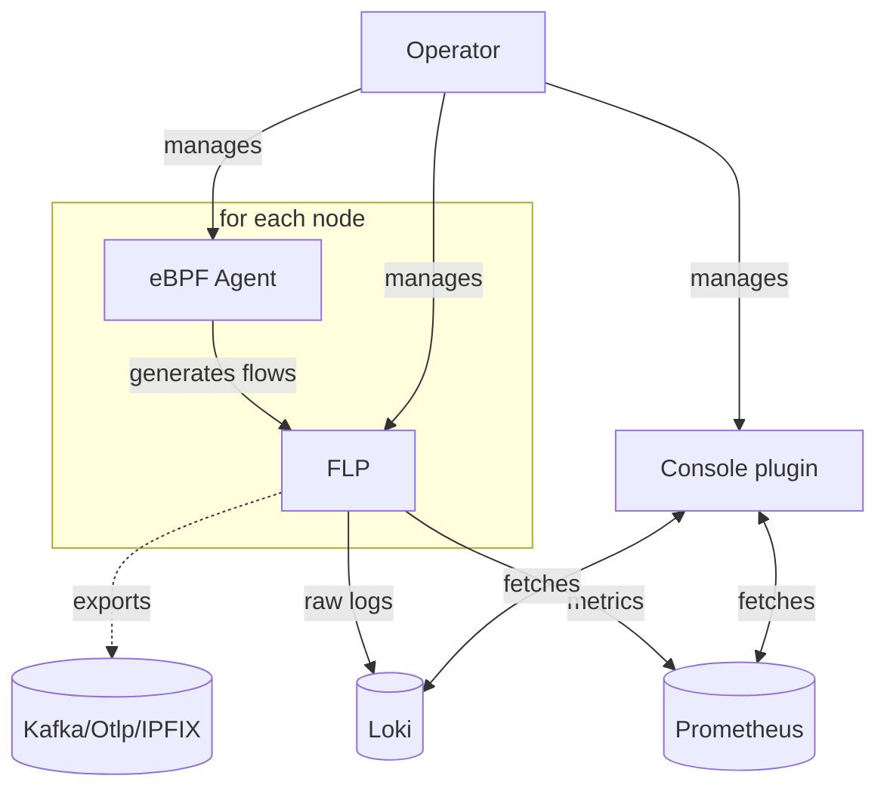
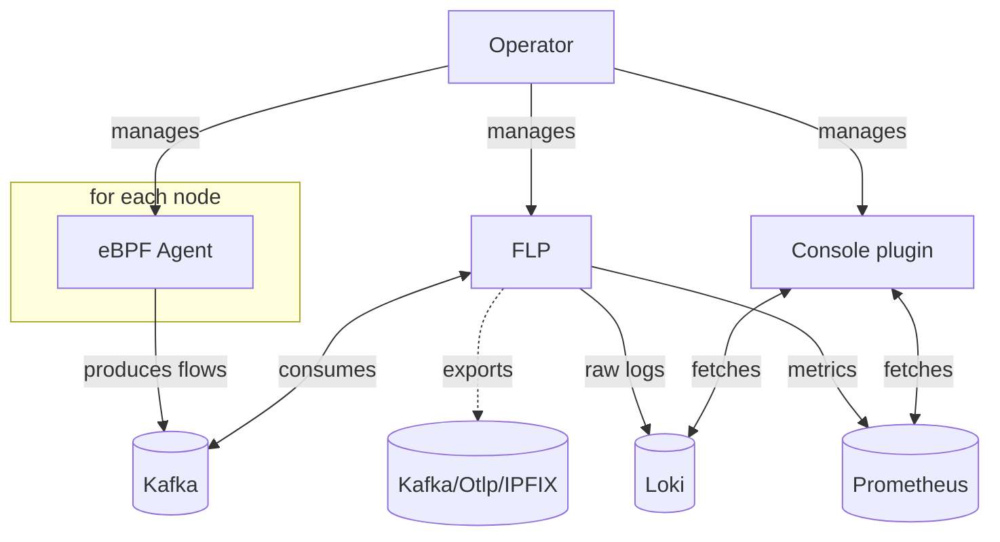
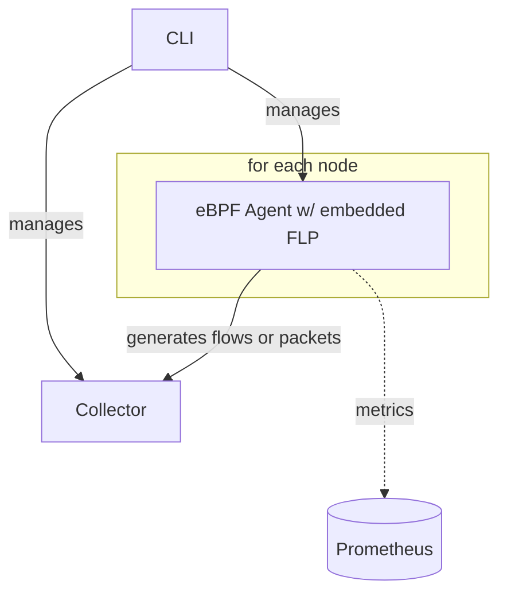

# NetObserv architecture

_See also: [architecture in the downstream documentation](https://docs.redhat.com/en/documentation/openshift_container_platform/4.18/html/network_observability/nw-network-observability-operator#network-observability-architecture_nw-network-observability-operator)_

NetObserv is a collection of components that can sometimes run independently, or as a whole.

The components are:

- An [eBPF agent](https://github.com/netobserv/netobserv-ebpf-agent), that generates network flows from captured packets.
  - It is attached to any/all of the network interfaces in the host, and listens for packets (ingress+egress) with [eBPF](https://ebpf.io/).
  - Packets are aggregated into logical flows (similar to NetFlows), periodically exported to a collector, generally FLP.
  - Optional features allow to add rich data, such as TCP latency or DNS information.
  - It is able to correlate those flows with other events such as network policy rules and drops (network policy correlation requires the [OVN Kubernetes](https://github.com/ovn-org/ovn-kubernetes/) network plugin).
  - When used with the CLI or as a standalone, the agent can also do full packet captures instead of generating logical flows.
- [Flowlogs-pipeline](https://github.com/netobserv/flowlogs-pipeline) (FLP), a component that collects, enriches and exports these flows.
  - It uses Kubernetes informers to enrich flows with details such as Pod names, namespaces, availability zones, etc.
  - It derives all flows into metric counters, for Prometheus.
  - Raw flows can be exported to Loki and/or custom exporters (Kafka, IPFIX, OpenTelemetry).
  - As a standalone, FLP is very flexible and configurable. It supports more inputs and outputs, allows more arbitrary filters, sampling, aggregations, relabelling, etc. When deployed via the operator, only a subset of its capacities is used.
- When used in OpenShift, [a Console plugin](https://github.com/netobserv/network-observability-console-plugin) for flows visualization with powerful filtering options, a topology representation and more (outside of OpenShift, [it can be deployed as a standalone](https://github.com/netobserv/network-observability-operator/blob/main/FAQ.md#how-do-i-visualize-flows-and-metrics)).
  - It provides a polished web UI to visualize and explore the flow logs and metrics stored in Loki and/or Prometheus.
  - Different views include metrics overview, a network topology and a table listing raw flows logs.
  - It supports multi-tenant access, making it relevant for various use cases: cluster/network admins, SREs, development teams...
- [An operator](https://github.com/netobserv/network-observability-operator) that manages all of the above.
  - It provides three APIs (CRD), one called [FlowCollector](https://github.com/netobserv/network-observability-operator/blob/main/docs/FlowCollector.md), which configures and pilots the whole deployment, another called [FlowCollectorSlice](https://github.com/netobserv/network-observability-operator/blob/main/docs/FlowCollectorSlice.md) for per-tenant configuration, and lastly [FlowMetrics](https://github.com/netobserv/network-observability-operator/blob/main/docs/FlowMetric.md) which allows to customize which metrics to generate out of flow logs.
  - As an [OLM operator](https://olm.operatorframework.io/), it is designed with `operator-sdk`, and allows subscriptions for easy updates.
- [A CLI](https://github.com/netobserv/network-observability-cli) that also manages some of the above components, for on-demand monitoring and packet capture.
  - It is provided as a `kubectl` or `oc` plugin, allowing to capture flows (similar to what the operator does, except it's on-demand and in the terminal), full packets (much like a `tcpdump` command) or metrics.
  - It is also available via [Krew](https://krew.sigs.k8s.io/).
  - It offers a live visualization via a TUI. For metrics, when used in OpenShift, it provides out-of-the-box dashboards.
  - Check out the blog post: [Network observability on demand](https://developers.redhat.com/articles/2024/09/17/network-observability-demand#what_is_the_network_observability_cli_).

## Direct deployment model

When using the operator with `FlowCollector` `spec.deploymentModel` set to `Direct`, agents and FLP are both deployed per node (as `DaemonSets`). This is perfect for an assessment of the technology, suitable on small clusters, but isn't very memory efficient in large clusters as every instance of FLP ends up caching the same cluster information, which can be huge.

Note that Loki isn't managed by the operator and must be installed separately, such as with the Loki operator. Same goes with Prometheus and any custom receiver.

<!-- You can use https://mermaid.live/ to test it -->

## Kafka deployment model

When using the operator with `FlowCollector` `spec.deploymentModel` set to `Kafka`, only the agents are deployed per node as a `DaemonSet`. FLP becomes a Kafka consumer that can be scaled independently. This is the recommended mode for large clusters, and is a more robust/resilient solution.

Like in `Direct` mode, data stores aren't managed by the operator. The same applies to the Kafka brokers and stores. You can check the Strimzi operator for that.

<!-- You can use https://mermaid.live/ to test it -->

## CLI

When using the CLI, the operator is not involved, which means you can use it without installing NetObserv as a whole. It uses a special mode of the eBPF agents that embeds FLP.

When running flows or packet capture, a collector Pod is deployed in addition to the agents. When capturing only metrics, the collector isn't deployed, and metrics are exposed directly from the agents, pulled by Prometheus.

<!-- You can use https://mermaid.live/ to test it -->

