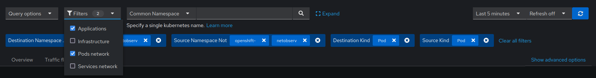

## Quick filters

### Presentation

Quick filters, a.k.a preset filters, are config-defined filters that show up in the Console plugin UI.



You can define any number of them in the `FlowCollector` config, and set any of them being active by default.

A single filter is defined as a map of keys and values, values being themselves a list, as a comma-separated string.

Like in the UI, exact matches are possible using double-quotes around values. Else, partial matches are used for textual values.

The _bang_ (`!`) character, placed at the end of a key, means negation.

As an example, here are the filters provided with the default `FlowCollector`:

```yaml
    quickFilters:
    - name: Applications                            # Name displayed in the UI
      filter:
        src_namespace!: 'openshift-,netobserv'      # filter key (src_namespace), negated (!), containing values "openshift-" or "netobserv"
        dst_namespace!: 'openshift-,netobserv'      # same as above for dst_namespace key
      default: true                                 # this filter will be active by default
    - name: Infrastructure
      filter:
        src_namespace: 'openshift-,netobserv'
        dst_namespace: 'openshift-,netobserv'
    - name: Pods network
      filter:
        src_kind: 'Pod'
        dst_kind: 'Pod'
      default: true
    - name: Services network
      filter:
        dst_kind: 'Service'
```

To recap, the filter named "Applications" shows all traffic that do not originate from, nor destinate to, any "openshift-*" or "netobserv" namespaces. It corresponds to what we assume being user applications traffic, as opposed to infrastructure traffic.

If for some reason this definition does not apply well to your situation, you can just modify the filters from the `FlowCollector` custom resource.

Note: the filter matching type, "all of" or "any of", is not controlled from there: this is a UI setting that the users can modify from the query options. We recommend designing these filters assuming the default matching type is used, which is "all of" (ie. filters are _ANDed_).

### Available filter keys

Here is a list of all available filter keys:

_Note: "Common" means filters for any of source or destination. For example, filtering `name: 'my-pod'` means all traffic from my-pod **+** all traffic to my-pod, regardless of the matching type used (all of / any of)._

<table>
  <thead>
      <tr>
          <th>Common</th>
          <th>Source</th>
          <th>Destination</th>
          <th>Description</th>
      </tr>
  </thead>
  <tbody>
    <tr>
      <td><b>namespace</b></td>
      <td>src_namespace</td>
      <td>dst_namespace</td>
      <td>Filter traffic related to a specific namespace.</td>
    </tr>
    <tr>
      <td><b>name</b></td>
      <td>src_name</td>
      <td>dst_name</td>
      <td>Filter traffic related to a given leaf resource name, such as a specific pods, service or node (for host-network traffic).</td>
    </tr>
    <tr>
      <td><b>kind</b></td>
      <td>src_kind</td>
      <td>dst_kind</td>
      <td>Filter traffic related to a given resource kind. It can be the kind of the leaf resource (<i>Pod</i>, <i>Service</i> or <i>Node</i>), or of the owner resource (e.g. <i>Deployment</i>, <i>StatefulSet</i>, etc.)</td>
    </tr>
    <tr>
      <td><b>owner_name</b></td>
      <td>src_owner_name</td>
      <td>dst_owner_name</td>
      <td>Filter traffic related to a given resource owner, that is, a workload / a set of pods. For example, it can be a Deployment name, a StatefulSet name, etc.</td>
    </tr>
    <tr>
      <td><b>resource</b></td>
      <td>src_resource</td>
      <td>dst_resource</td>
      <td>Filter traffic related to a specific resource denotated by its canonical name, that identifies it uniquely. The canonical notation is <i>kind.namespace.name</i> for namespaced kinds, or <i>node.name</i> for nodes. E.g: <i>Deployment.my-namespace.my-web-server</i>.</td>
    </tr>
    <tr>
      <td><b>address</b></td>
      <td>src_address</td>
      <td>dst_address</td>
      <td>Filter traffic related to an IP address. IPv4 and IPv6 are supported. CIDR ranges are also supported.</td>
    </tr>
    <tr>
      <td><b>mac</b></td>
      <td>src_mac</td>
      <td>dst_mac</td>
      <td>Filter traffic related to a MAC address.</td>
    </tr>
    <tr>
      <td><b>port</b></td>
      <td>src_port</td>
      <td>dst_port</td>
      <td>Filter traffic related to a specific port.</td>
    </tr>
    <tr>
      <td><b>host_address</b></td>
      <td>src_host_address</td>
      <td>dst_host_address</td>
      <td>Filter traffic related to the host IP where pods are running.</td>
    </tr>
    <tr>
      <td><b>protocol</b></td>
      <td><i>N/A</i></td>
      <td><i>N/A</i></td>
      <td>Filter traffic related to a protocol (e.g. TCP, UDP, etc.).</td>
    </tr>
  </tbody>
</table>
